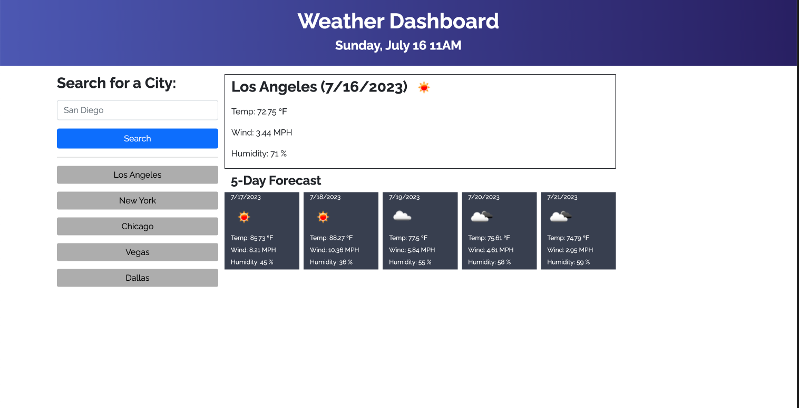

# Weather Station
## Description
The Weather Station application allow you to search for weather conditions in any city you choose. It shows both today's forecast and a 5-day future forecast. Weather conditions shown are temperature, wind, and humidity. It also saves any previous cities you searched for.
## Installation
N/A
## Usage
Users input the city they would like to see weather conditions for in the search bar. Hitting the search button shows the current weather conditions in the main section on the left. Five day forecasts are shown below the main section. Under the search bar, a list of cities is shown which you have searched for. Clicking on any of those cities will return the weather conditions for that city.

#### Repository
https://github.com/bklein1981/weather-station

#### URL
https://bklein1981.github.io/weather-station/
